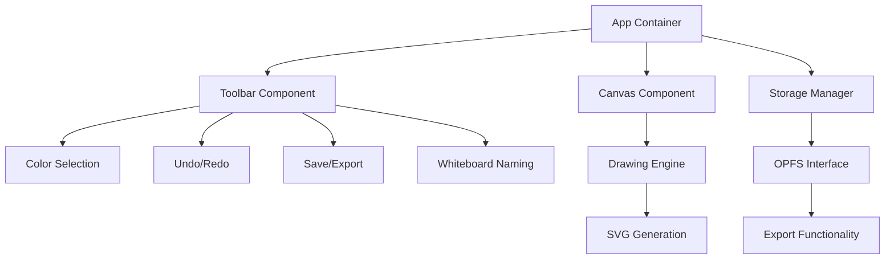

# System Patterns

## System Architecture
The Black and White Board application follows a component-based architecture with a focus on separation of concerns. The system is structured around these core components:

## Key Components

### App Container
- Acts as the main application shell
- Manages state across components
- Handles initialization and setup
- Coordinates between UI and storage components

### Canvas Component
- Provides the infinite drawing surface
- Manages viewport and panning
- Captures user input (mouse/touch events)
- Renders the current drawing state

### Toolbar Component
- Houses UI controls for the application
- Organized with drawing tools at the bottom
- Utility functions (undo, redo, save) at the top
- Provides visual feedback for active tools/colors

### Drawing Engine
- Processes drawing commands
- Maintains drawing history for undo/redo
- Converts between canvas operations and SVG paths
- Handles different pen colors and styles

### Storage Manager
- Interfaces with the Origin Private File System (OPFS)
- Manages saving and loading of whiteboards
- Handles whiteboard naming and organization
- Provides export functionality to local machine

## Design Patterns

### Command Pattern
Used for drawing operations to enable undo/redo functionality. Each drawing action is encapsulated as a command object that can be executed, undone, and redone.

### Observer Pattern
Implemented to update the UI when the drawing state changes, ensuring the canvas reflects the current state and history controls are appropriately enabled/disabled.

### Factory Pattern
Employed for creating different types of drawing tools (pens of different colors, eraser) with consistent interfaces.

### Singleton Pattern
Applied to the Storage Manager to ensure a single point of access to the OPFS functionality.

### State Pattern
Used to manage the current tool selection and application mode.

## Data Flow

1. User interacts with the canvas or toolbar
2. Events trigger commands in the drawing engine
3. Commands update the internal state and canvas display
4. State changes are reflected in the UI (e.g., enabling/disabling undo/redo)
5. Save operations persist the current state to OPFS
6. Export operations generate SVG files from the current state

## Technical Decisions

- **HTML5 Canvas for Drawing**: Provides high-performance real-time drawing capabilities
- **SVG for Storage/Export**: Ensures compatibility with other applications
- **OPFS for Local Storage**: Offers secure, origin-bound storage without size limitations
- **Vanilla JavaScript**: Maximizes compatibility and minimizes dependencies
- **Component-Based Structure**: Enhances maintainability and separation of concerns
